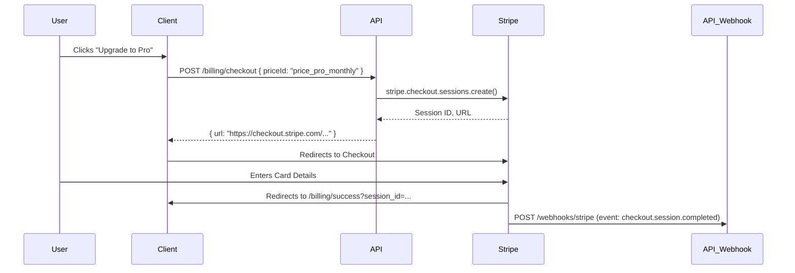
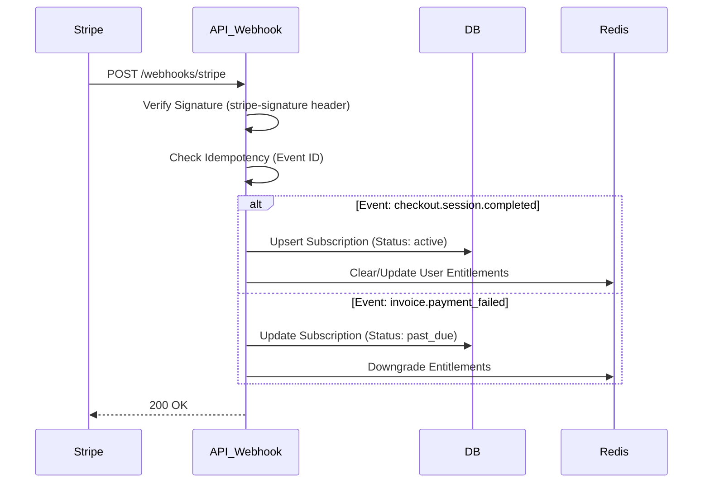

# Phase 1A: Stripe Implementation Guide

**Status**: Ready for Implementation
**Target**: Stream 1A (Stripe Integration)
**Priority**: High (30%)

## 1. Overview
This guide details the integration of Stripe for subscription management. We utilize **Stripe Checkout** for the payment UI (hosted by Stripe) and **Webhooks** for fulfillment. This minimizes PCI compliance scope to "SAQ A" (we never touch raw card data).

## 2. Configuration Checklist

### 2.1 Stripe Dashboard Setup
- [ ] Create **Products**:
    - "Pro Plan" (Service)
    - "Enterprise" (Service)
- [ ] Create **Prices**:
    - `price_pro_monthly` ($29/mo)
    - `price_pro_yearly` ($290/yr)
- [ ] Configure **Customer Portal**:
    - Allow: Cancel, Pause, Update Payment Method.
    - Disallow: Switch Plans (handle via custom UI/Checkout if complex).
- [ ] Get **API Keys**:
    - `STRIPE_SECRET_KEY` (sk_test_...)
    - `STRIPE_PUBLISHABLE_KEY` (pk_test_...)
    - `STRIPE_WEBHOOK_SECRET` (whsec_...)

## 3. Data Flow

### 3.1 Checkout Flow (User Upgrade)

### 3.2 Webhook Flow (Fulfillment)

## 4. Implementation Specifications

### 4.1 `BillingService` (`apps/api/src/services/billing.ts`)
- **Dependencies**: `stripe` SDK, `SubscriptionRepo`.
- **Methods**:
    - `createCheckoutSession(profileId, priceId)`: Returns session URL. Metadata: `{ profileId }`.
    - `createPortalSession(profileId)`: Returns portal URL.
    - `handleWebhook(event)`: Dispatcher for event types.

### 4.2 Webhook Handler (`apps/api/src/routes/webhooks/stripe.ts`)
- **Security**:
    - MUST verify `stripe-signature` using raw body.
    - **Note**: Fastify needs raw body access. Use `fastify-raw-body` plugin or similar.
- **Idempotency**:
    - Store processed `event.id` in Redis/DB (`processed_webhooks` table) with 24h TTL.
    - If `event.id` exists, return `200 OK` immediately.

### 4.3 Events to Handle
| Event | Action |
| :--- | :--- |
| `checkout.session.completed` | **Critical**. Create/Link Subscription. Grant Pro access. |
| `customer.subscription.updated` | Handle renewals, cancellations (set `cancel_at_period_end`), upgrades. |
| `customer.subscription.deleted` | **Critical**. Downgrade to FREE immediately. |
| `invoice.payment_succeeded` | Log for audit (optional). |
| `invoice.payment_failed` | Email user (via Stripe or App). Downgrade if grace period over. |

## 5. Security & PCI Compliance
- **Never** accept credit card numbers on your server.
- **Always** use `https` in production.
- **Webhook Secret**: Store in 1Password/Env vars. NEVER commit to code.
- **Customer Data**: Only store `stripe_customer_id` mapping to `profile_id`.

## 6. Error Recovery
- **Webhook Failures**: Stripe retries for 3 days (exponential backoff).
- **Manual Sync**: Implement `POST /billing/sync` (Admin only) to pull latest state from Stripe API if webhooks fail catastrophically.

## 7. Database Schema (Reference)
See `packages/schema/src/billing.ts`.
Ensure `subscriptions` table has unique constraint on `stripe_subscription_id`.

## 8. Test Mode vs Production
- Use `STRIPE_SECRET_KEY` to switch environments.
- **Test Clocks**: Use Stripe Test Clocks to simulate monthly renewals instantly in integration tests.
