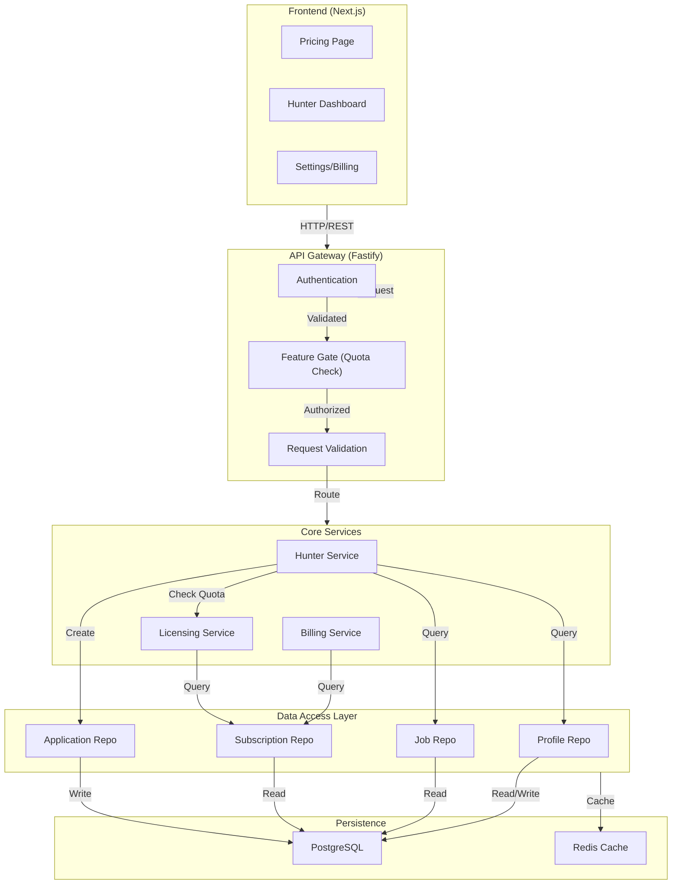
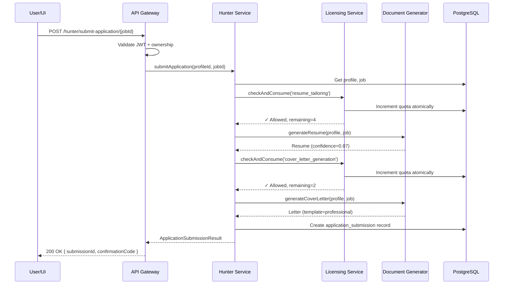
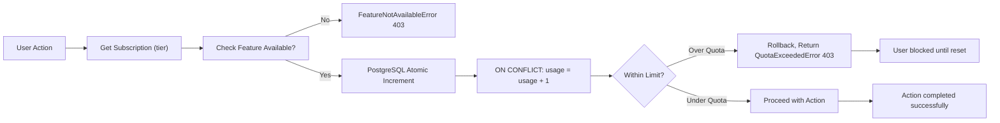
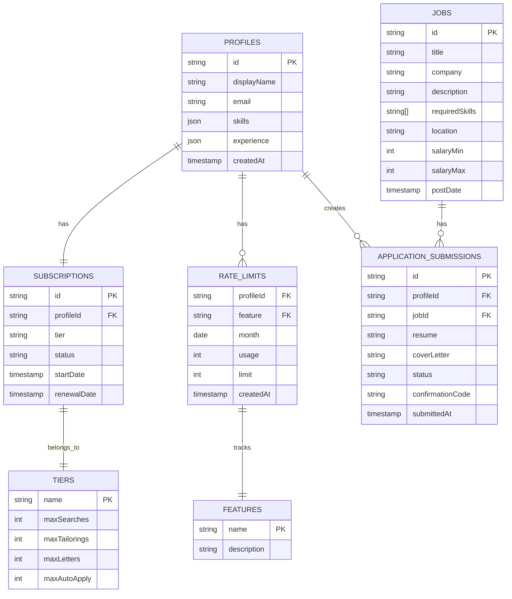

# Architecture Diagrams

## System Architecture

```mermaid
graph TB
    subgraph UI["Frontend (Next.js)"]
        PricingPage["Pricing Page"]
        HunterDashboard["Hunter Dashboard"]
        SettingsPage["Settings/Billing"]
    end

    subgraph Gateway["API Gateway (Fastify)"]
        AuthMiddleware["Authentication"]
        FeatureGate["Feature Gate (Quota Check)"]
        RequestValidation["Request Validation"]
    end

    subgraph Services["Core Services"]
        HunterService["Hunter Service"]
        BillingService["Billing Service"]
        LicensingService["Licensing Service"]
    end

    subgraph Repos["Data Access Layer"]
        ProfileRepo["Profile Repo"]
        JobRepo["Job Repo"]
        SubRepo["Subscription Repo"]
        AppRepo["Application Repo"]
    end

    subgraph Databases["Persistence"]
        PostgreSQL["PostgreSQL"]
        Redis["Redis Cache"]
    end

    UI -->|HTTP/REST| Gateway
    Gateway -->|Request| AuthMiddleware
    AuthMiddleware -->|Validated| FeatureGate
    FeatureGate -->|Authorized| RequestValidation
    RequestValidation -->|Route| Services

    HunterService -->|Query| ProfileRepo
    HunterService -->|Query| JobRepo
    HunterService -->|Check Quota| LicensingService
    BillingService -->|Query| SubRepo
    LicensingService -->|Query| SubRepo
    HunterService -->|Create| AppRepo

    ProfileRepo -->|Read/Write| PostgreSQL
    JobRepo -->|Read| PostgreSQL
    SubRepo -->|Read| PostgreSQL
    AppRepo -->|Write| PostgreSQL
    Repos -->|Cache| Redis
```

## Job Application Workflow

```mermaid
sequenceDiagram
    participant User as User/UI
    participant API as API Gateway
    participant Hunter as Hunter Service
    participant Licensing as Licensing Service
    participant Generator as Document Generator
    participant DB as PostgreSQL

    User->>API: POST /hunter/submit-application/{jobId}
    API->>API: Validate JWT + ownership
    API->>Hunter: submitApplication(profileId, jobId)

    Hunter->>DB: Get profile, job
    Hunter->>Licensing: checkAndConsume('resume_tailoring')
    Licensing->>DB: Increment quota atomically
    Licensing-->>Hunter: ✓ Allowed, remaining=4

    Hunter->>Generator: generateResume(profile, job)
    Generator-->>Hunter: Resume (confidence=0.87)

    Hunter->>Licensing: checkAndConsume('cover_letter_generation')
    Licensing->>DB: Increment quota atomically
    Licensing-->>Hunter: ✓ Allowed, remaining=2

    Hunter->>Generator: generateCoverLetter(profile, job)
    Generator-->>Hunter: Letter (template=professional)

    Hunter->>DB: Create application_submission record
    Hunter-->>API: ApplicationSubmissionResult

    API-->>User: 200 OK { submissionId, confirmationCode }
```

## Quota Enforcement (Atomic)

```mermaid
graph LR
    A["User Action"] --> B["Get Subscription (tier)"]
    B --> C["Check Feature Available?"]
    C -->|No| D["FeatureNotAvailableError 403"]
    C -->|Yes| E["PostgreSQL Atomic Increment"]
    E --> F["ON CONFLICT: usage = usage + 1"]
    F --> G{Within Limit?}
    G -->|Over Quota| H["Rollback, Return QuotaExceededError 403"]
    G -->|Under Quota| I["Proceed with Action"]
    H --> J["User blocked until reset"]
    I --> K["Action completed successfully"]
```

## Tier-Based Access Control

```mermaid
graph TB
    subgraph Features["Hunter Features"]
        Analyze["Skill Gap Analysis"]
        Search["Job Search"]
        Resume["Resume Tailoring"]
        Letter["Cover Letter"]
        AutoApply["Auto-Submit"]
    end

    subgraph Free["FREE TIER"]
        FA["✓ Unlimited"]
        FB["✓ 5/month"]
        FC["✗ N/A"]
        FD["✗ N/A"]
        FE["✗ N/A"]
    end

    subgraph Pro["PRO TIER"]
        PA["✓ Unlimited"]
        PB["✓ Unlimited"]
        PC["✓ 5/month"]
        PD["✓ 3/month"]
        PE["✓ 5/month"]
    end

    subgraph Enterprise["ENTERPRISE TIER"]
        EA["✓ Unlimited"]
        EB["✓ Unlimited"]
        EC["✓ Unlimited"]
        ED["✓ Unlimited"]
        EE["✓ Unlimited"]
    end

    Analyze --> FA
    Analyze --> PA
    Analyze --> EA

    Search --> FB
    Search --> PB
    Search --> EB

    Resume --> FC
    Resume --> PC
    Resume --> EC

    Letter --> FD
    Letter --> PD
    Letter --> ED

    AutoApply --> FE
    AutoApply --> PE
    AutoApply --> EE
```

## Data Model Relationships

```mermaid
erDiagram
    PROFILES ||--|| SUBSCRIPTIONS : has
    PROFILES ||--o{ RATE_LIMITS : has
    PROFILES ||--o{ APPLICATION_SUBMISSIONS : creates
    JOBS ||--o{ APPLICATION_SUBMISSIONS : has
    SUBSCRIPTIONS ||--|| TIERS : belongs_to
    RATE_LIMITS ||--|| FEATURES : tracks

    PROFILES {
        string id PK
        string displayName
        string email
        json skills
        json experience
        timestamp createdAt
    }

    SUBSCRIPTIONS {
        string id PK
        string profileId FK
        string tier
        string status
        timestamp startDate
        timestamp renewalDate
    }

    RATE_LIMITS {
        string profileId FK
        string feature FK
        date month
        int usage
        int limit
        timestamp createdAt
    }

    JOBS {
        string id PK
        string title
        string company
        string description
        string[] requiredSkills
        string location
        int salaryMin
        int salaryMax
        timestamp postDate
    }

    APPLICATION_SUBMISSIONS {
        string id PK
        string profileId FK
        string jobId FK
        string resume
        string coverLetter
        string status
        string confirmationCode
        timestamp submittedAt
    }

    TIERS {
        string name PK
        int maxSearches
        int maxTailorings
        int maxLetters
        int maxAutoApply
    }

    FEATURES {
        string name PK
        string description
    }
```
