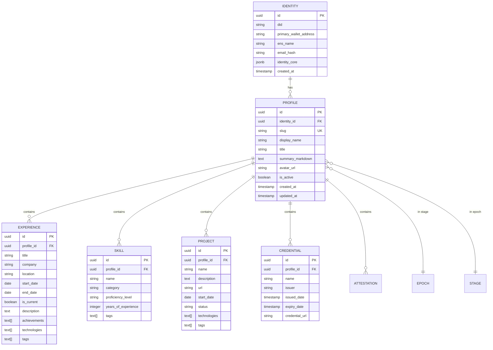

# Architecture Diagrams

Visual documentation of the **In Midst My Life** system architecture using Mermaid diagrams.

---

## System Overview

### High-Level Architecture


---

## Application Architecture

### Monorepo Structure


---

## Data Flow

### Profile Retrieval with Mask Filter


### Narrative Generation Flow


---

## Hunter Protocol Architecture

### Job Search & Application Flow


### Hunter Agent Workflow


---

## Deployment Architecture

### Docker Compose (Development)


### Kubernetes (Production)


---

## Database Schema

### Entity Relationship Diagram



### Mask & Taxonomy Tables


---

## Frontend Architecture

### Next.js App Structure

```mermaid
graph TB
    subgraph "App Router"
        ROOT[app/layout.tsx<br/>Root Layout]
        HOME[app/page.tsx<br/>Home]
        
        PROFILE_LAYOUT[app/profile/[id]/layout.tsx]
        PROFILE[app/profile/[id]/page.tsx]
        TIMELINE[app/profile/[id]/timeline/page.tsx]
        GRAPH[app/profile/[id]/graph/page.tsx]
        GALLERY[app/profile/[id]/gallery/page.tsx]
    end
    
    subgraph "Components"
        SERVER[Server Components<br/>- ProfileHeader<br/>- ExperienceList]
        CLIENT[Client Components<br/>- MaskSelector<br/>- TimelineGraph<br/>- GraphVisualization]
    end
    
    subgraph "Libraries"
        API_LIB[lib/api.ts<br/>API Client]
        TYPES[lib/types.ts<br/>TypeScript Types]
    end
    
    ROOT --> HOME
    ROOT --> PROFILE_LAYOUT
    PROFILE_LAYOUT --> PROFILE
    PROFILE_LAYOUT --> TIMELINE
    PROFILE_LAYOUT --> GRAPH
    PROFILE_LAYOUT --> GALLERY
    
    PROFILE --> SERVER
    PROFILE --> CLIENT
    TIMELINE --> CLIENT
    GRAPH --> CLIENT
    
    SERVER --> API_LIB
    CLIENT --> API_LIB
    API_LIB --> TYPES
    
    style ROOT fill:#e3f2fd
    style SERVER fill:#4caf50
    style CLIENT fill:#ff9800
    style API_LIB fill:#9c27b0
```

### Component Hierarchy


---

## References

- [SPEC-002-system-design.md](../SPEC-002-system-design.md)
- [ARCH-001-system-architecture.md](../ARCH-001-system-architecture.md)
- [ADR 001: Monorepo Structure](./adr/001-monorepo-structure.md)
- [ADR 002: PostgreSQL Database](./adr/002-postgresql-primary-database.md)
- [ADR 003: Redis Caching](./adr/003-redis-caching-queue.md)
- [ADR 005: Mask System](./adr/005-mask-based-identity.md)
- [ADR 006: Next.js Frontend](./adr/006-nextjs-frontend.md)
