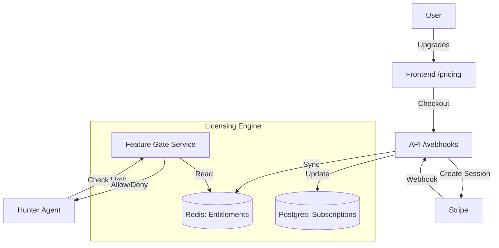

# PLAN-PHASE-1-MONETIZATION: Architecture & Design

**Status**: Planning
**Owner**: Architect (Stream 1)
**Dependencies**: Phase 0 (Hunter Protocol) - Complete

## 1. Executive Summary
Phase 1 transforms "in-midst-my-life" from a local tool into a SaaS platform. We introduce a tiered subscription model (Free vs. Pro) enforced by Feature Gates and powered by Stripe.

The core philosophy is **"Gate the Automation, not the Data."** Users always own their data (CV, Masks), but the *autonomous* agents (Hunter) are metered.

## 2. Architecture Overview



## 3. Data Model (Schema)

Defined in `packages/schema/src/billing.ts`.

### 3.1 Subscription (Postgres)
Source of truth for billing state.
- `id`: UUID
- `profile_id`: UUID (Foreign Key)
- `stripe_subscription_id`: String
- `tier`: FREE | PRO | ENTERPRISE
- `status`: active | past_due | canceled

### 3.2 Feature Flags (Config)
Hardcoded or DB-backed configuration of plans.
- **FREE**:
    - `hunter_job_searches`: 5 / month
    - `masks_limit`: 3
- **PRO**:
    - `hunter_job_searches`: Unlimited (Fair use: 100/day)
    - `masks_limit`: 16

### 3.3 Entitlements (Redis)
Cached, fast-access view of what a user can do *right now*.
Key: `entitlements:{profileId}`
Value: JSON
```json
{
  "tier": "PRO",
  "features": {
    "hunter_job_searches": { "limit": -1, "used": 42 },
    "masks_limit": { "limit": 16, "used": 5 }
  }
}
```

## 4. Implementation Streams

### Stream 1B: Feature Gates & Licensing (Priority 1)
**Goal**: Enforce limits immediately, even if everyone is "Free".
**Tasks**:
1.  Create `LicensingService` in `packages/core` (or `apps/api/services`).
2.  Implement `checkEntitlement(profileId, feature)` middleware.
3.  Inject `LicensingService` into `HunterAgent`.
4.  Add Redis usage tracking (e.g., `INCR usage:hunter:{profileId}`).

### Stream 1A: Stripe Integration (Priority 2)
**Goal**: Allow users to pay to lift limits.
**Tasks**:
1.  Set up Stripe account and Products.
2.  Implement `BillingService` in `apps/api`.
3.  Create `POST /billing/checkout` endpoint.
4.  Create `POST /webhooks/stripe` handler to process `checkout.session.completed` and `customer.subscription.updated`.

### Stream 1C: Marketing & UI (Priority 3)
**Goal**: Sell the value.
**Tasks**:
1.  Create `/pricing` page in `apps/web`.
2.  Add "Upgrade" banners in `HunterDashboard` when limits are hit.
3.  Create Landing Page explaining the "Theatrical Identity" concept.

## 5. API Contract

### Licensing
- `GET /api/licensing/me`: Returns current limits and usage.
    ```json
    {
      "tier": "FREE",
      "features": {
        "hunter_searches": { "limit": 5, "remaining": 2, "reset": "2026-02-01" }
      }
    }
    ```

### Billing
- `POST /api/billing/checkout`:
    - Body: `{ priceId: string, interval: "month" | "year" }`
    - Returns: `{ url: string }` (Stripe Checkout URL)
- `POST /api/billing/portal`:
    - Returns: `{ url: string }` (Stripe Customer Portal)

## 6. Hunter Protocol Integration

**Before**:
```typescript
async findJobs(params) {
  // Just search
}
```

**After**:
```typescript
async findJobs(params) {
  const allowed = await licensing.consume(params.profileId, "hunter_job_searches", 1);
  if (!allowed) throw new UsageLimitError("Upgrade to Pro to continue searching.");
  
  // Search...
}
```

## 7. Migration & Backwards Compatibility
- All existing users (from Phase 0) will be initialized as `FREE` tier on first login/access.
- A migration script `scripts/init_subscriptions.ts` will create default subscription records for existing profiles.

## 8. Success Criteria
- [ ] Non-paying users blocked after 5 searches.
- [ ] Paying users can search unlimitedly.
- [ ] Stripe webhooks correctly update Tier in < 5 seconds.
- [ ] "Upgrade" flow works end-to-end.
