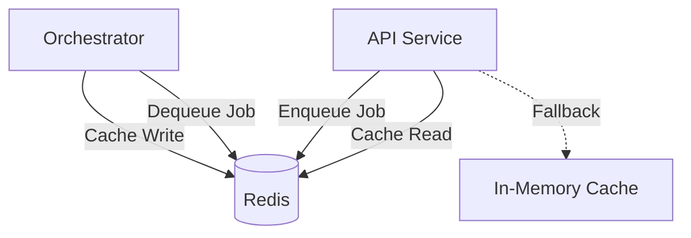

# ADR 003: Redis for Caching and Job Queue

**Status:** Accepted  
**Date:** 2025-01-15  
**Deciders:** Core Team

## Context

We need solutions for:
1. **Caching**: Reduce database load for frequently-accessed, rarely-changing data (taxonomy)
2. **Job Queue**: Asynchronous task processing for long-running operations (narrative generation, job search)
3. **Rate Limiting**: Track API usage quotas per user/feature

## Decision

We will use **Redis 7** for:
- Caching (taxonomy endpoints)
- Job queue (via BullMQ)
- Rate limiting (future)

With **in-memory fallback** for caching when Redis is unavailable.

## Rationale

### Why Redis?

**Advantages:**
- **Performance**: In-memory, microsecond latency
- **Versatility**: One tool for cache + queue + rate limiting
- **Simplicity**: Easy to deploy and operate
- **Persistence**: AOF (Append-Only File) for durability
- **Data Structures**: Lists for queues, strings for cache, sorted sets for rate limiting

### Caching Use Cases

**What We Cache:**
- Taxonomy data (masks, epochs, stages)
- Profile summaries (short-lived)
- API responses (rare, for expensive queries)

**What We Don't Cache:**
- User-specific data
- Frequently-changing data
- Large objects (>1MB)

**Cache Strategy:**
- **TTL**: 1 hour for taxonomy (infrequently updated)
- **Invalidation**: Manual flush on taxonomy updates
- **Fallback**: In-memory Map when Redis unavailable

### Job Queue Use Cases

**Async Tasks:**
- Narrative generation (LLM calls, 5-30s)
- Job search (external API calls, 10-60s)
- PDF generation (rendering, 2-10s)
- Email sending (SMTP, 1-5s)

**BullMQ Features:**
- **Priorities**: High-priority jobs first
- **Retries**: Exponential backoff on failure
- **Scheduled Jobs**: Delay/repeat functionality
- **Concurrency**: Process multiple jobs in parallel

### Why Not Alternatives?

**Memcached (for caching):**
- No persistence
- No data structures (only key-value)
- No pub/sub (needed for future features)

**RabbitMQ (for queue):**
- Overkill for our needs
- More complex to operate
- No built-in retries/delays

**Database-backed Queue:**
- Poor performance under load
- Locks and contention issues
- Harder to scale

## Architecture



## Implementation

### Caching

```typescript
// Cache interface (packages/core/src/cache.ts)
interface CacheProvider {
  get(key: string): Promise<string | null>;
  set(key: string, value: string, ttl?: number): Promise<void>;
  del(key: string): Promise<void>;
}

// Redis implementation
class RedisCache implements CacheProvider {
  async get(key: string) {
    return this.client.get(key);
  }
  async set(key: string, value: string, ttl = 3600) {
    return this.client.set(key, value, 'EX', ttl);
  }
}

// In-memory fallback
class InMemoryCache implements CacheProvider {
  private cache = new Map();
  async get(key: string) {
    return this.cache.get(key) || null;
  }
  async set(key: string, value: string, ttl?: number) {
    this.cache.set(key, value);
    if (ttl) setTimeout(() => this.cache.delete(key), ttl * 1000);
  }
}
```

### Job Queue

```typescript
// Queue setup (apps/orchestrator/src/queue.ts)
import { Queue, Worker } from 'bullmq';

const taskQueue = new Queue('task-queue', {
  connection: { url: process.env.REDIS_URL },
  defaultJobOptions: {
    attempts: 3,
    backoff: { type: 'exponential', delay: 1000 },
  },
});

const worker = new Worker('task-queue', async (job) => {
  const handler = taskHandlers[job.data.type];
  return await handler(job.data);
}, {
  connection: { url: process.env.REDIS_URL },
  concurrency: 5,
});
```

## Configuration

### Redis Settings

```yaml
# docker-compose.yml
redis:
  image: redis:7-alpine
  command: ["redis-server", "--appendonly", "yes"]
  volumes:
    - redisdata:/data
  ports:
    - "6379:6379"
```

### Environment Variables

```bash
# API (caching optional)
REDIS_URL=redis://redis:6379        # Optional

# Orchestrator (queue required)
ORCH_REDIS_URL=redis://redis:6379   # Required
TASK_QUEUE=redis                    # Required
```

## Consequences

### Positive

- **Performance**: 10-100x faster than database for cached data
- **Scalability**: Offload long tasks from API
- **Reliability**: Retries and error handling built-in
- **Simplicity**: Single tool for multiple use cases
- **Graceful Degradation**: In-memory fallback for cache

### Negative

- **Another Dependency**: More infrastructure to manage
- **Persistence Trade-offs**: Data loss possible if Redis crashes (mitigated by AOF)
- **Memory Limits**: Redis data stored in RAM

### Neutral

- **Cache Invalidation**: Classic hard problem (manual flush on updates)
- **Queue Monitoring**: Need dashboard (Bull Board recommended)

## Monitoring

### Metrics

```bash
# Redis info
redis-cli INFO stats
redis-cli INFO memory

# Queue metrics (via BullMQ)
- Jobs waiting
- Jobs active
- Jobs completed
- Jobs failed
- Processing time p50/p95/p99
```

### Alerts

- Redis memory usage >80%
- Connection failures
- Queue depth >1000 jobs
- Failed job rate >5%

## Failure Modes

### Redis Unavailable

**Caching:**
- Falls back to in-memory cache
- Logs warning
- Continues serving requests (may be slower)

**Job Queue:**
- Jobs cannot be enqueued
- Returns error to client
- Client should retry

### Redis Out of Memory

- Enable `maxmemory-policy allkeys-lru`
- Alert when usage >80%
- Scale up or flush old data

## Alternatives Considered

### AWS ElastiCache

**Not Yet:**
- Vendor lock-in
- More expensive
- Same Redis underneath
- **Future**: Consider for production scaling

### Valkey (Redis fork)

**Watching:**
- Redis license change concerns
- Valkey maintains BSD license
- **Decision**: Stick with Redis 7 for now, easy to switch if needed

## References

- [Redis Documentation](https://redis.io/docs/)
- [BullMQ Documentation](https://docs.bullmq.io/)
- [SPEC-002-system-design.md](../../SPEC-002-system-design.md)
- [WORK-002-automation-spec.md](../../WORK-002-automation-spec.md)
