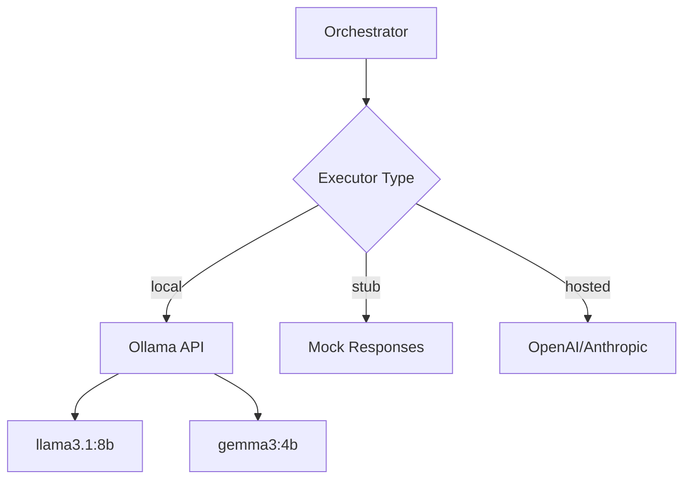

# ADR 004: Local-First LLM with Ollama

**Status:** Accepted  
**Date:** 2025-01-15  
**Deciders:** Core Team

## Context

The system requires LLM capabilities for:
- Narrative generation (résumé text from structured data)
- Skill gap analysis (compare job requirements to profile)
- Cover letter generation
- Autonomous code agents (future)

We need to decide:
1. Local vs. hosted LLMs
2. Which models to support
3. How to handle structured outputs
4. Fallback strategies

## Decision

**Default to local LLMs via Ollama**, with support for hosted providers as optional configuration.

### Supported Executors

1. **Local (Ollama)** - Default
   - Models: llama3.1:8b, gemma3:4b, mistral:7b
   - Response format: text (plain text outputs)
   - Tools: Optional (enable via `ORCH_TOOL_ALLOWLIST`)

2. **Stub** - Development/Testing
   - Returns mock responses
   - No actual LLM calls
   - Useful for CI/CD

3. **Hosted** (Future) - OpenAI, Anthropic, etc.
   - Requires explicit opt-in
   - API keys via environment variables

## Rationale

### Why Local-First?

**Philosophy:**
- **Privacy**: User data never leaves infrastructure
- **Cost**: No per-token charges
- **Control**: No rate limits, model availability issues
- **Open Source**: Aligned with project values

**Practical Benefits:**
- No API key management for basic usage
- Predictable costs (compute only)
- Works offline (local development)
- No external dependencies for core features

### Why Ollama?

**Advantages:**
- **Easy Setup**: `brew install ollama && ollama pull llama3.1`
- **Model Library**: 100+ pre-configured models
- **OpenAI-Compatible API**: Easy to integrate
- **Performance**: Optimized inference (llama.cpp underneath)
- **Cross-Platform**: macOS, Linux, Docker

**vs. Alternatives:**
- **LM Studio**: GUI-focused, less scriptable
- **llama.cpp**: Lower-level, harder to use
- **vLLM**: Optimized for servers, overkill for our scale

### Model Selection

**Default: llama3.1:8b**
- Good balance of quality and speed
- 8B parameters = reasonable resource requirements
- Strong instruction following
- Open source (Llama 3.1 license)

**Alternative: gemma3:4b**
- Smaller, faster
- Good for simple tasks (skill extraction)
- Lower memory requirements (3GB vs 6GB)

**Not Using GPT-4/Claude:**
- Cost ($0.01-0.03 per request for narratives)
- Privacy concerns
- Availability/rate limits
- **Future**: Support as opt-in for premium tier

## Architecture



## Configuration

### Environment Variables

```bash
# Executor type
ORCH_AGENT_EXECUTOR=local              # local | stub | hosted

# Local LLM (Ollama)
LOCAL_LLM_API=ollama                   # ollama | llamacpp
LOCAL_LLM_URL=http://localhost:11434   # Ollama endpoint
LOCAL_LLM_MODEL=llama3.1:8b            # Model name
LOCAL_LLM_ALLOWED_HOSTS=localhost,host.docker.internal

# Response format
ORCH_LLM_RESPONSE_FORMAT=text          # text | structured-json

# Tools (optional)
ORCH_TOOL_ALLOWLIST=                   # Empty = no tools
# Or: ORCH_TOOL_ALLOWLIST=rg,ls,cat    # Enable specific tools

# Hosted (future)
OPENAI_API_KEY=sk-...                  # If executor=hosted
```

### Docker Configuration

```yaml
# docker-compose.yml
orchestrator:
  environment:
    ORCH_AGENT_EXECUTOR: local
    LOCAL_LLM_URL: http://host.docker.internal:11434
    LOCAL_LLM_ALLOWED_HOSTS: host.docker.internal
  extra_hosts:
    - "host.docker.internal:host-gateway"
```

## Implementation

### Agent Executor Interface

```typescript
// apps/orchestrator/src/agents/executor.ts
interface AgentExecutor {
  execute(prompt: string, options?: ExecuteOptions): Promise<string>;
}

class LocalLLMExecutor implements AgentExecutor {
  async execute(prompt: string) {
    const response = await fetch(`${this.url}/api/generate`, {
      method: 'POST',
      body: JSON.stringify({
        model: this.model,
        prompt,
        stream: false,
      }),
    });
    return response.json().then(r => r.response);
  }
}

class StubExecutor implements AgentExecutor {
  async execute(prompt: string) {
    return JSON.stringify({ mock: "response" });
  }
}
```

### Response Format Handling

**Text Mode (Default):**
```typescript
// Simple prompt, parse text response
const prompt = "Extract skills from: ${jobDescription}";
const response = await executor.execute(prompt);
// Parse response manually (flexible, works with any model)
```

**Structured JSON Mode (Optional):**
```typescript
// Requires model support (llama3.1+)
const prompt = "Extract skills as JSON: ${jobDescription}";
const response = await executor.execute(prompt, { format: "json" });
const parsed = JSON.parse(response);
```

## Performance Considerations

### Resource Requirements

| Model | RAM | GPU | Speed (tokens/s) |
|-------|-----|-----|------------------|
| gemma3:4b | 3GB | Optional | ~40 |
| llama3.1:8b | 6GB | Optional | ~25 |
| mistral:7b | 5GB | Optional | ~30 |

### Optimization Strategies

1. **Model Caching**: Keep model loaded in memory
2. **Batching**: Process multiple requests together (future)
3. **Prompt Optimization**: Shorter prompts = faster responses
4. **Quantization**: Use Q4 quantized models (smaller, faster)

### Expected Latency

- Skill extraction: ~2-5s
- Narrative generation: ~5-15s
- Cover letter: ~10-30s

## Consequences

### Positive

- **Privacy**: All data processing local
- **Cost**: No per-request charges
- **Reliability**: No external API dependencies
- **Flexibility**: Easy to switch models
- **Development**: Works offline

### Negative

- **Resource Usage**: Requires 4-8GB RAM for LLM
- **Setup**: Users must install Ollama
- **Quality**: May be lower than GPT-4 (acceptable trade-off)

### Neutral

- **Model Updates**: Manual (run `ollama pull <model>`)
- **Scaling**: Need GPU for high throughput (future)

## Migration Path

### Phase 1: Local Only (Current)
- Ollama with llama3.1:8b
- Text responses
- No tools

### Phase 2: Enhanced Local
- Add structured JSON support
- Enable tools for code agents
- Support multiple models per task type

### Phase 3: Hybrid
- Allow hosted LLMs as opt-in
- User choice: privacy vs. quality
- Tiered pricing (free = local, pro = hosted)

## Quality Assurance

### Testing Strategy

```typescript
// Unit tests with stub executor
const executor = new StubExecutor();
const result = await generateNarrative(profile, executor);

// Integration tests with local LLM
if (process.env.INTEGRATION_LLM === 'true') {
  const executor = new LocalLLMExecutor();
  const result = await generateNarrative(profile, executor);
  expect(result).toContain('experience');
}

// Manual QA with hosted LLM (optional)
```

### Prompt Engineering

- Use few-shot examples in prompts
- Clear instructions and format specifications
- Validate outputs with Zod schemas
- Retry on parse failures

## Monitoring

### Metrics

- LLM request latency (p50/p95/p99)
- Token count per request
- Error rate (connection, timeout, parse errors)
- Model memory usage

### Alerts

- LLM unavailable
- Response time >30s
- Error rate >10%

## Security Considerations

### Prompt Injection

- Sanitize user inputs
- Use structured prompts
- Validate outputs against schema

### Resource Limits

- Timeout after 60s
- Max prompt length: 4000 tokens
- Rate limiting per user (future)

## References

- [Ollama Documentation](https://ollama.ai/docs)
- [Llama 3.1 Model Card](https://ai.meta.com/llama/)
- [ORCH-002-execution-strategy.md](../../ORCH-002-execution-strategy.md)
- [WORK-002-automation-spec.md](../../WORK-002-automation-spec.md)
