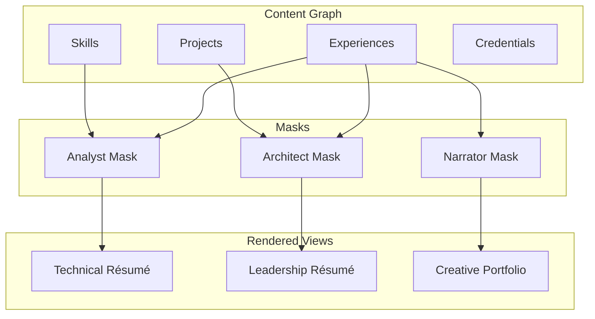

# ADR 005: Mask-Based Identity System

**Status:** Accepted  
**Date:** 2025-01-15  
**Deciders:** Core Team

## Context

Traditional résumés are static documents that fail to represent the multifaceted nature of professional identity. A single person may be:
- An analyst in technical contexts
- An architect in system design contexts
- A narrator in communication contexts
- A strategist in planning contexts

We need a system that allows **dynamic identity projection** based on context while maintaining a single source of truth.

## Decision

Implement a **mask-based identity system** where:
- All CV data stored in a normalized graph structure
- Masks are **contextual filters** applied at read-time
- Masks never modify underlying data
- Multiple masks can coexist simultaneously

### Core Concepts

**Mask**: A filter configuration that determines:
- What data to show (inclusion/exclusion rules)
- How to present it (tone, compression, emphasis)
- What relationships to highlight

**Ontologies** (Mask Categories):
1. **Cognitive**: How you think (analyst, synthesist, speculator)
2. **Expressive**: How you communicate (narrator, artisan, provoker)
3. **Operational**: How you execute (executor, steward, calibrator)

## Rationale

### Why Masks?

**Problem with Traditional Résumés:**
- One-size-fits-all document
- Emphasizes most recent experience
- Difficult to highlight different aspects for different audiences
- Static presentation

**Mask-Based Advantages:**
- **Contextual**: Different mask for technical vs. leadership roles
- **Dynamic**: Real-time filtering without data duplication
- **Honest**: Same underlying data, different presentation
- **Efficient**: Write once, project many ways

### Philosophical Foundation

**Blockchain-CV Analogy** (from FOUND-001):
- **CV = Blockchain**: Immutable ledger of experiences
- **Résumé = State Snapshot**: Derived view at a point in time
- **Mask = Query Function**: How to extract state from ledger

**Identity as Performance** (from META-001):
- Professional identity is **performative** (context-dependent)
- Masks acknowledge this multiplicity
- Not deception, but **appropriate context matching**

## Architecture



## Mask Structure

```typescript
interface Mask {
  id: string;
  name: string;
  ontology: 'cognitive' | 'expressive' | 'operational';
  functional_scope: string;
  
  // Presentation parameters
  stylistic_parameters: {
    tone: 'formal' | 'conversational' | 'technical';
    rhetorical_mode: 'analytical' | 'narrative' | 'persuasive';
    compression_ratio: number; // 0-1, how much to compress
  };
  
  // Activation rules
  activation_rules: {
    contexts: string[];      // e.g., ["technical", "leadership"]
    triggers: string[];       // e.g., ["backend", "architecture"]
  };
  
  // Filter rules
  filters: {
    include_tags: string[];  // Show only these tags
    exclude_tags: string[];  // Never show these tags
    priority_weights: {      // Boost importance of certain types
      [key: string]: number;
    };
  };
}
```

## Predefined Masks

### Cognitive Ontology

1. **Analyst**: Precision reasoning, structured analysis
2. **Synthesist**: Connect disparate ideas, pattern recognition
3. **Observer**: Data collection, empirical grounding
4. **Strategist**: Long-term planning, risk assessment
5. **Speculator**: Hypothesis generation, exploration
6. **Interpreter**: Translate between domains, explain complexity

### Expressive Ontology

7. **Artisan**: Craft-level creation, attention to detail
8. **Architect**: System composition, structural design
9. **Narrator**: Storytelling, coherent presentation
10. **Provoker**: Challenge assumptions, critical thinking
11. **Mediator**: Resolve conflicts, find common ground
12. **Integrator**: Combine perspectives, holistic view

### Operational Ontology

13. **Executor**: Action-oriented, results delivery
14. **Steward**: Maintenance, sustainability, care
15. **Custodian**: Preservation, knowledge management
16. **Calibrator**: Optimization, fine-tuning, balance

## Implementation

### Mask Selection API

```typescript
// POST /profiles/{id}/masks/select
{
  "contexts": ["technical", "backend"],
  "tags": ["distributed-systems", "postgres"],
  "limit": 3
}

// Response
{
  "masks": [
    { "id": "analyst", "name": "Analyst", "relevanceScore": 0.95 },
    { "id": "architect", "name": "Architect", "relevanceScore": 0.87 },
    { "id": "executor", "name": "Executor", "relevanceScore": 0.72 }
  ]
}
```

### Narrative Generation with Mask

```typescript
// POST /profiles/{id}/narrative
{
  "maskId": "analyst",
  "contexts": ["technical"],
  "tags": ["backend"]
}

// Response
{
  "narrative_blocks": [
    {
      "block_id": "nb-1",
      "text": "Designed and implemented a scalable microservices architecture...",
      "weight": 0.9,
      "sources": ["exp-123"],
      "meta": {
        "personality": "analytical",
        "setting": "technical"
      }
    }
  ]
}
```

### Export with Mask Filter

```bash
# PDF export with specific mask
curl -o resume.pdf \
  "http://localhost:3001/profiles/{id}/export/pdf?maskId=analyst"
```

## Consequences

### Positive

- **Flexibility**: Adapt résumé to any context without rewriting
- **Honesty**: Same data, different emphasis (not deceptive)
- **Efficiency**: Maintain one profile, generate many views
- **Discoverability**: Explore different professional facets
- **AI-Friendly**: Structured system for LLM-based generation

### Negative

- **Complexity**: More complex than traditional résumé
- **Learning Curve**: Users need to understand mask concept
- **Selection Overhead**: Choosing appropriate mask takes thought

### Neutral

- **Mask Proliferation**: May need to limit number of custom masks
- **Ontology Evolution**: Taxonomy may need refinement over time

## User Experience

### Web UI

```
[Profile View]
  
  Current Mask: Analyst ▼
  
  [Analyst] [Architect] [Narrator] [+Custom]
  
  [Timeline View] [Graph View] [Gallery]
  
  Experiences (filtered by mask):
  ● Senior Engineer at Acme (2020-2023)
    - Architected distributed system (emphasized)
    - Led team of 5 engineers (de-emphasized)
```

### Multiple Mask Views

Users can compare how different masks present the same data:

```
Split View:
[Analyst Mask]        |  [Architect Mask]
- Focus: Details      |  - Focus: Systems
- Tone: Technical     |  - Tone: Strategic
- Shows: Code, DBs    |  - Shows: Design, Scale
```

## Validation

### Mask Quality Metrics

- **Coverage**: What % of profile data is shown?
- **Relevance**: How well does output match context?
- **Coherence**: Does narrative flow naturally?
- **Differentiation**: Are masks meaningfully different?

### A/B Testing (Future)

- Track which masks lead to job applications
- Measure click-through rates per mask
- User feedback on mask relevance

## Extensions

### Custom Masks (Phase 2)

Allow users to create custom masks:
```typescript
{
  "name": "Data Science Lead",
  "based_on": "analyst",  // Inherit from base mask
  "filters": {
    "include_tags": ["ml", "data", "python"],
    "exclude_tags": ["frontend"]
  }
}
```

### Mask Recommendations (Phase 3)

AI-powered mask selection:
```typescript
// Analyze job description
const jobDescription = "Looking for a backend engineer...";

// Recommend masks
const masks = await recommendMasks(profile, jobDescription);
// ["analyst", "architect", "executor"]
```

## Alternatives Considered

### 1. Multiple Résumé Files

**Rejected because:**
- Data duplication
- Maintenance nightmare
- Inconsistencies inevitable

### 2. Tags Only (No Masks)

**Rejected because:**
- Too granular, not enough structure
- Doesn't capture presentation style
- No semantic meaning

### 3. Role-Based Profiles

**Rejected because:**
- Too rigid (only one role per résumé)
- Doesn't capture multifaceted identity
- Artificial boundaries

## References

- [SPEC-003-mask-taxonomy.md](../../SPEC-003-mask-taxonomy.md)
- [FOUND-001-blockchain-cv-analogy.md](../../FOUND-001-blockchain-cv-analogy.md)
- [FOUND-002-blockchain-cv-vs-resume.md](../../FOUND-002-blockchain-cv-vs-resume.md)
- [META-001-project-bible.md](../../META-001-project-bible.md)
