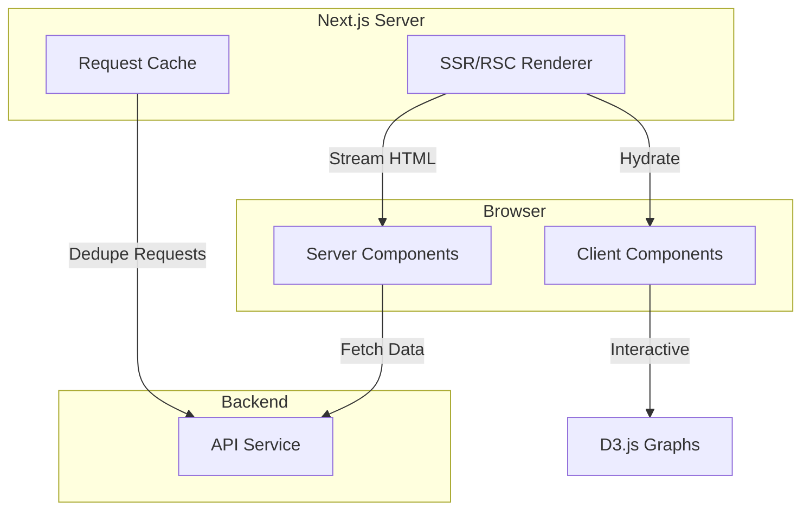

# ADR 006: Next.js 15 for Frontend with App Router

**Status:** Accepted  
**Date:** 2025-01-15  
**Deciders:** Core Team

## Context

We need a frontend framework that supports:
- Server-side rendering (SSR) for SEO and performance
- Interactive visualizations (D3.js for graphs)
- Real-time updates (future: WebSockets)
- Type-safe integration with API
- Modern developer experience

## Decision

Use **Next.js 15** with **App Router** (React Server Components) for the frontend application.

### Stack

- **Framework**: Next.js 15
- **Styling**: Tailwind CSS
- **Visualization**: D3.js (dynamic import for client-side only)
- **State Management**: React hooks + Context (no Redux)
- **API Client**: Native fetch with type-safe wrappers

## Rationale

### Why Next.js?

**Technical Advantages:**
- **SSR/SSG**: Pre-render pages for performance and SEO
- **File-based Routing**: Intuitive, scales well
- **API Routes**: Built-in backend (though we use separate API service)
- **Image Optimization**: Automatic responsive images
- **TypeScript**: First-class support

**Developer Experience:**
- **Fast Refresh**: Instant feedback on changes
- **Built-in Tools**: ESLint, TypeScript, bundling
- **Large Ecosystem**: Rich plugin ecosystem
- **Active Development**: Meta/Vercel backing

### Why App Router (vs. Pages Router)?

**React Server Components (RSC):**
- Fetch data on server, send only HTML
- Reduce JavaScript bundle size
- Better performance on initial load

**Streaming:**
- Progressive rendering of UI
- Show content as it loads
- Better perceived performance

**Modern Patterns:**
- Collocate data fetching with components
- Better code organization
- Future-proof architecture

### Why Not Alternatives?

**SvelteKit:**
- Smaller ecosystem
- Less mature SSR story
- Team more familiar with React

**Remix:**
- Excellent framework
- Next.js has larger ecosystem
- More resources/tutorials available

**Astro:**
- Great for content sites
- Less suited for interactive apps
- No built-in React state management

**Plain React (Vite):**
- No SSR (bad for SEO)
- Manual routing setup
- Less integrated tooling

## Architecture



## Implementation

### Project Structure

```
apps/web/
├── src/
│   ├── app/                    # App Router pages
│   │   ├── layout.tsx         # Root layout (Server)
│   │   ├── page.tsx           # Home (Server)
│   │   ├── profile/
│   │   │   └── [id]/
│   │   │       ├── page.tsx   # Profile page (Server)
│   │   │       └── layout.tsx # Profile layout
│   ├── components/
│   │   ├── server/            # Server Components
│   │   │   └── ProfileHeader.tsx
│   │   └── client/            # Client Components
│   │       ├── MaskSelector.tsx
│   │       └── TimelineGraph.tsx
│   └── lib/
│       ├── api.ts             # API client
│       └── types.ts           # Shared types
```

### Server Components (Default)

```typescript
// app/profile/[id]/page.tsx
import { getProfile } from '@/lib/api';

export default async function ProfilePage({ 
  params 
}: { 
  params: { id: string } 
}) {
  // Fetch on server
  const profile = await getProfile(params.id);
  
  return (
    <div>
      <h1>{profile.displayName}</h1>
      <MaskSelector profileId={profile.id} />
    </div>
  );
}
```

### Client Components (Opt-in)

```typescript
// components/client/MaskSelector.tsx
'use client';

import { useState } from 'react';

export function MaskSelector({ profileId }: { profileId: string }) {
  const [selectedMask, setSelectedMask] = useState('analyst');
  
  return (
    <div>
      <button onClick={() => setSelectedMask('analyst')}>
        Analyst
      </button>
      {/* Interactive UI */}
    </div>
  );
}
```

### Dynamic Imports (D3.js)

```typescript
// components/client/TimelineGraph.tsx
'use client';

import dynamic from 'next/dynamic';

const D3Timeline = dynamic(() => import('./D3Timeline'), {
  ssr: false,
  loading: () => <div>Loading graph...</div>,
});

export function TimelineGraph({ data }) {
  return <D3Timeline data={data} />;
}
```

## Configuration

### next.config.js

```javascript
/** @type {import('next').NextConfig} */
const nextConfig = {
  reactStrictMode: true,
  
  // Environment variables
  env: {
    NEXT_PUBLIC_API_BASE_URL: process.env.NEXT_PUBLIC_API_BASE_URL,
  },
  
  // Image optimization
  images: {
    domains: ['example.com'],
  },
  
  // Bundle analysis
  webpack: (config, { dev, isServer }) => {
    if (!dev && !isServer) {
      // Analyze bundle size
      config.optimization.splitChunks = {
        chunks: 'all',
        cacheGroups: {
          d3: {
            test: /[\\/]node_modules[\\/](d3.*)[\\/]/,
            name: 'd3',
            priority: 10,
          },
        },
      };
    }
    return config;
  },
};

module.exports = nextConfig;
```

### tailwind.config.js

```javascript
/** @type {import('tailwindcss').Config} */
module.exports = {
  content: [
    './src/pages/**/*.{js,ts,jsx,tsx,mdx}',
    './src/components/**/*.{js,ts,jsx,tsx,mdx}',
    './src/app/**/*.{js,ts,jsx,tsx,mdx}',
  ],
  theme: {
    extend: {
      colors: {
        // Custom color palette
      },
    },
  },
  plugins: [],
};
```

## Performance Considerations

### Bundle Size Targets

- Initial JS: <200KB gzipped
- Initial CSS: <50KB gzipped
- LCP (Largest Contentful Paint): <2.5s
- FID (First Input Delay): <100ms
- CLS (Cumulative Layout Shift): <0.1

### Optimization Strategies

1. **Code Splitting**: Dynamic imports for heavy components (D3)
2. **Server Components**: Fetch data on server, reduce client JS
3. **Image Optimization**: Next.js Image component
4. **Font Optimization**: Self-host fonts, preload
5. **Caching**: Aggressive caching headers for static assets

### Lighthouse Scores (Target)

- Performance: >90
- Accessibility: >95
- Best Practices: >95
- SEO: >95

## Deployment

### Build Command

```bash
pnpm --filter @in-midst-my-life/web build
```

### Environment Variables

```bash
# Runtime (server)
NEXT_PUBLIC_API_BASE_URL=https://api.inmidstmylife.com
NEXT_PUBLIC_ORCH_BASE_URL=https://orch.inmidstmylife.com

# Build time
NEXT_PUBLIC_GRAPH_LAYOUT=radial  # radial | force
```

### Docker

```dockerfile
FROM node:22-alpine
WORKDIR /app

# Install dependencies
COPY package.json pnpm-lock.yaml ./
RUN corepack enable && pnpm install --frozen-lockfile

# Build
COPY . .
RUN pnpm build

# Production
ENV NODE_ENV=production
CMD ["pnpm", "start"]
```

## Consequences

### Positive

- **Performance**: Fast initial load with SSR
- **SEO**: Pre-rendered HTML for search engines
- **Developer Experience**: Modern React patterns, great DX
- **Type Safety**: End-to-end types from API to UI
- **Ecosystem**: Large community, many libraries

### Negative

- **Learning Curve**: App Router is new (2023)
- **Breaking Changes**: Next.js evolves quickly
- **Bundle Size**: React + Next.js is heavier than alternatives
- **Vercel Lock-in**: Some features work best on Vercel

### Neutral

- **Server Requirements**: Need Node.js server (can't deploy to CDN)
- **Hydration**: Must carefully manage server/client boundary

## Testing Strategy

### Unit Tests (Vitest)

```typescript
// components/MaskSelector.test.tsx
import { render, screen } from '@testing-library/react';
import { MaskSelector } from './MaskSelector';

test('renders mask options', () => {
  render(<MaskSelector profileId="123" />);
  expect(screen.getByText('Analyst')).toBeInTheDocument();
});
```

### E2E Tests (Playwright)

```typescript
// e2e/profile.spec.ts
import { test, expect } from '@playwright/test';

test('view profile timeline', async ({ page }) => {
  await page.goto('/profile/123');
  await expect(page.locator('h1')).toContainText('John Doe');
  await page.click('button:has-text("Timeline")');
  await expect(page.locator('.timeline')).toBeVisible();
});
```

## Future Considerations

### React Server Actions (Phase 2)

```typescript
// app/profile/[id]/actions.ts
'use server';

export async function updateProfile(formData: FormData) {
  // Server-side form handling
  const response = await fetch('http://api:3001/profiles/...', {
    method: 'PATCH',
    body: JSON.stringify(formData),
  });
  
  revalidatePath(`/profile/${id}`);
}
```

### Streaming (Phase 3)

```typescript
// app/profile/[id]/page.tsx
import { Suspense } from 'react';

export default function ProfilePage() {
  return (
    <>
      <ProfileHeader />
      <Suspense fallback={<SkeletonTimeline />}>
        <Timeline />
      </Suspense>
      <Suspense fallback={<SkeletonExperiences />}>
        <Experiences />
      </Suspense>
    </>
  );
}
```

### Partial Prerendering (Experimental)

```typescript
// next.config.js
experimental: {
  ppr: true,  // Partial Prerendering
}
```

## References

- [Next.js 15 Documentation](https://nextjs.org/docs)
- [React Server Components](https://react.dev/blog/2023/03/22/react-labs-what-we-have-been-working-on-march-2023#react-server-components)
- [SPEC-002-system-design.md](../../SPEC-002-system-design.md)
- [PHASE-1C-UI-DESIGN-SPEC.md](../../PHASE-1C-UI-DESIGN-SPEC.md)
